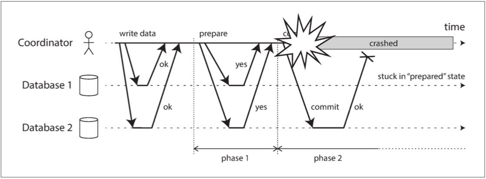

本文主要记述在学习 2PC 和 3PC 时的一些思考

## 2PC

关于 2PC 网上有许多文章介绍，在这里不做赘述。下面提几个关键点以及其和 3PC 的联系

对于分布式事务而言，其也要保证 Atomicity,即 All-Or-Nothing,其要存在一个 Commit Point。在这之前事务视作失败（Nothing），在这之后事务视作成功（All）。2PC 中，Coordinator 在 Vote 阶段收到所有 Participants 的 agree 后，在向 Participants 发送 commit message 之前，会先在 Log 上写下相关记录。在磁盘上 log 的记录成功视作 Commit Point,在此之后即便 Coordinator crash,其可以通过 Log 得知当前状态，继续完成剩余的阶段(Commit).反之，即便得到所有 Participants 的 agree，Coordinator 在 Log 记录成功前 crash，重启后会选择 abort.

2PC 属于 Blocking protocol，在下图 DDIA 提到的例子中：如果 Coordinator 崩溃，Participants 将无法继续推进，只能等待 Coordinator recovery，原因在于 Database1 收到 commit 后提交了事务，而 Database2 由于无法收到 Coordinator 的信息，它并不清楚事务整体上是 Abort 还是 Commit，无论采取什么样的行为，都会有风险和其他副本不再保持一致。当然理论上，Participants 在无法收到 Coordinator 信息后可以彼此之间互相交流从而推进事务：

1. If no participants had received a commit message, 没有提交发生，可以选择 abort 整个事务
2. If any participant had received a commit message,已经有提交发生，其余的 Participants 可以跟进提交事务

不过以上这些并不包括在 2PC 的内容之内

### 更棘手的情况

以上提到的解决方案适用于只有 Coordinator 失效的情况 ，如果 Coordinator 和某一个 Participant 一起 failed，而且恰好失效的 Participant 是被 Coordinator  通知的第一个对象并且已经进行了提交。即便剩余存活的 Participant 可以交换信息，由于它们无法得知失效的 Participant 的状态，因此选择 commit 或者 abort 都存在风险。即使有新的 coordinator ，而一般 Log 中不会记录 commit 信息目前已经发送给了哪些 Participant(每次发送前都要记录对性能是一种拖累)，在得到所有 Participant 回应之前，它也不得不一直 block

## 3PC

3PC 是为了解决 2PC 问题设计出来的 Nonblocking protocol，其介绍可以参考 wiki[^3]（个人觉得讲得比网络上的一些文章明白清晰）

3PC 可以视作将 2PC 的 commit phase 拆成了 preCommit 以及 doCommit 两个 phase，doCommit 实际上做了跟 2PC 第二个阶段几乎一样的事情，而 preCommit 相当于提供了一段缓冲，让 participant 有机会知道 vote 的结果。

如果 Coordinator 在发送 preCommit messages 之前 crash，participants 可以一致认为事务 aborted.而 Coordinator 只会在得到所有 Participants 对 preCommit messages 的 Ack 后才会发送 doCommit message.

在网上阅读一些文章时，有的人评论中提到如果 3PC 遇到了 2PC 在上文遭遇的情况该怎么办？这里体现的正是 3PC 的精妙所在：2PC 中大家并不知道失效的 participant 状况，它既有可能在 vote 阶段选择了 abort,也有可能在 commit 阶段已经率先提交了事务；而 3PC中, Coordinator 失效后，新的节点可以接管事务，并且询问剩余的 participant 的状态：

1. 如果所有的 participants 都已经收到了 preCommit  messages，那么新的 Coordinator 可以认为事务能够提交

   

   大家收到 preCommit messages 的前提是所有人在 vote 阶段都 agree，所以如果剩余存活的 participants 都收到了 preCommit, 无论失效的 participant 是否收到 preCommit,coordinator 选择提交是没有风险（否则失效节点也不会在 vote 阶段选择 agree）

   

2. 如果有任意一个 participant 没有收到 preCommit messages,那么  Coordinator 可以选择 abort transaction 或者重新启动整个事务提交的流程

   

   在这里可以放心大胆地 abort 的原因正是只有所有的 participants 收到 preCommit后才会进入提交阶段，换言之，只要有任意一个未收到，那么不会有任意一个副本已经提交了从而造成与其他 abort 事务的副本不一致的状态

   

*不过 3PC 并没有解决所有的问题，如果出现了 network partition，one partition 中所有的 participants 收到了 preCommit messages, the other partition 中的 participant 则没有，那么两边可能会分别 abort 或 commit 事务，从而当网络恢复时会出现副本状态不一致的情况。此外由于 3PC 多了一个阶段，需要交换的信息也变多了，对于对  latency 要求比较严格的应用来说可能不是那么适合。不过至少 3PC 不会因为 single node failures 而 block，所以如果对高可用性有一定要求可以考虑 3PC*

## Reference

[^1]: [2PC](https://www.the-paper-trail.org/post/2008-11-27-consensus-protocols-two-phase-commit/)
[^2]:[3PC](https://www.the-paper-trail.org/post/2008-11-29-consensus-protocols-three-phase-commit/)
[^3]:[3PC-wiki](https://en.wikipedia.org/wiki/Three-phase_commit_protocol#:~:text=From%20Wikipedia%2C%20the%20free%20encyclopedia%20In%20computer%20networking,failure-resilient%20refinement%20of%20the%20two-phase%20commit%20protocol%20%282PC%29.)

