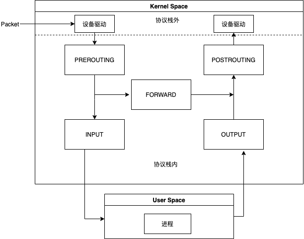

## 负载均衡方案

服务器集群对外提供服务时，我们希望请求尽可能平均地分散到各台机器上，有一些负载均衡的解决方案

### DNS

基于 DNS 的负载均衡实现比较简单，成本低：当 DNS 请求到达 DNS Server 解析域名时，Server 可以根据一些调度策略（按地域、按运营商等等）回复 Client 集群中任意一台服务器的 IP 地址，客户端接下来的请求在 TTL 所指定的时间内将一直发送到此服务器进行处理。

但是基于 DNS 的均衡负载流量调度以主机 IP 为单位而非连接，其粒度过大，不均衡（因为用户的访问模式可能存在差异）；而且 DNS Server 从客户端的 IP 地址中其实能获取的信息并不会太多（地域、运营商），这使得其负载均衡的策略极为有限；同时由于客户端在 TTL 时间内都会使用该解析记录，TTL 的值设置上：过小会导致 DNS 流量很高，过大会严重影响负载均衡的效果，同时如果节点发生故障，即使 DNS Server 的维护人员可以通过监测获知并迅速剔除故障节点，但在 TTL 还没过期时，原先分配到故障节点的客户端仍然会继续向其请求服务，会给用户带来很糟糕的体验。

### 硬件

由专门的硬件设备（dispatcher）来实现，dispatcher 对用户来说是透明的，集群只需要对外提供一个虚拟 IP，在集群内部可以以内网 IP 进行通信转发请求，其功能以及性能强大，但是价格昂贵、可扩展性差以及调试维护麻烦

### 软件

例如 Nginx 以及 LVS，简单灵活且便宜，而且可以根据业务特点比较方便地进行扩展以及定制功能

## LVS的组成

### 相关术语

- DS（Director Server），前端的负载均衡节点服务器，其接受所有传入的客户端请求
- RS（Real Server），真实服务器是构成 LVS 集群的节点，提供服务
- VIP（Virtual IP），为客户端提供服务的 IP 地址
- RIP（Real IP），真实服务器的 IP 地址
- CIP（Client IP）,客户端的 IP 地址
- DIP（Director IP），负载均衡器与后端真实服务器通信的 IP 地址

### 组成部分

- IPVS(IP Virtual Server)：基于内核态 netfilter 实现，工作在内核态
- IPVSADM(IP Virtual Server Administrator): LVS 用户态的配套管理工具，基于 netlink 或 raw socket 的方式与内核 LVS 通信

类比：如果 IPVS 为 netfilter,那么 IPVSADM 为 iptables（*注：iptables 正是通过 netlink 与 netfilter通信*）

### Netfilter 和 IPTABLES

iptables 在 Docker 以及 K8s 中应用甚广。我的文章[Kubernetes网络学习整理](https://flaglord.com/2021/05/26/Kubernetes%E7%BD%91%E7%BB%9C%E5%AD%A6%E4%B9%A0%E6%95%B4%E7%90%86/)中可以看到 iptables 频繁出现。

底层的 netfilter 其本质就是在整个网络流程的若干位置放置一些钩子，并在每个钩子上挂载一些处理函数进行处理

IP 层的 5 个钩子点的位置为：

- PREROUTING
- POSTROUTING
- FORWARD
- INPUT
- OUTPUT

在 PREROUTING 处可以进行 DNAT，在 POSTROUTING 处可以进行 SNAT，而在 FORWARD 则可以设置一些过滤函数

### LVS工作原理

LVS 工作在 INPUT 链上，流程大致如下：

1. 在 PREROUTING 查找路由，确认 VIP 是本机地址则进入 INPUT 链
2. 如果 VIP 和 端口 确实为 IPVS 服务，INPUT 上挂载的 ipvs_hook函数 会被调用，强制修改数据包的相关数据，送向 OUTPUT 链

### 工作方式

有三种 IP 负载均衡技术：NAT 、IPTunneling 以及 DR

### NAT

客户端会使用 DNS 解析的 VIP 进行访问，到达 load balancer后，它首先会检查包的 destination address 以及 port number.如果其与 LVS service 相匹配，会根据调度算法从集群中选出一个 RS ，同时包的 destination address 和 port number 会使用 RS 的数据进行重写。包发送向选择的 RS 后，reply 会因为相应的路由规则送给 load balancer(网关)，在里面 source IP 会被重写为 VIP，保持了整个过程对 Client 的透明

**Advantages**:

- 可以运行在任何支持 TCP/IP Protocol 的操作系统上（包括 Windows），且支持端口映射
- 只需要 一个 IP 地址供 load balancer 使用，load balancer 和 Cluster 通信可以使用内网 IP

**Disadvantages:**

- 可扩展性比较差，Load balancer 很容易成为 bottleneck，因为 request 以及 reply 都需要由其来进行重写

LVS-NAT 复用了 Linux Kernel 中有关 netfilter 以及 iptables 中的相当多的代码，不过它将原本 O(n) 的链式判断变为了 Map O(1) 级别，加快了转发效率。

除了之后提到的两种工作模式，使用 DNS hybrid 可以解决瓶颈问题，可以有许多 load balancers 共同工作，只需要 DNS Server 解析时使用 Round-Robin 即可 

#### IP Tunneling

简单地说就是将原来的 packet 作为 payload 再封装在新的报文中，RS 上的 tun 设备会拆封，然后将 VIP 识别为本机的地址，将 reply 不经 load balance 送回客户端

**Advantages:**

- 性能表现好
- 可以跨机房

**Disadvantages:**

- 需要 Server 支持 “IP Tunneling”(IP Encapsulation) protocol
- 在国内 VIP 与后端服务器可能存在跨运营商的情况，有可能被运营商的策略认为是IP伪造请求而被拦截

*Note: 在VS/TUN 以及后面提到的 VS/DR clusters 中，VIP 被 load balancer 以及 RSs 同时共享，在一些情况下，load balancer 和一些 RSs 在同一个 网络中，如果 RS 也回应 arp 报文请求，会存在 race condition.报文将一会儿被送给 load balancer,一会送给某一 RS，另一会儿被送给另一 RS，LVS cluster 将无法正常工作。所以我们需要保证 RS （与 load balancer 同网络中的）不回复关于 VIP 的 arp 请求，但允许其处理 destination IP 为 VIP 的包*

#### DR 

工作流程图与 IP Tunneling 相仿，但是在实现上不同的是报文并未被再次封装，而是由 load balancer 直接路由给 RS（将报文目的 MAC 地址改为选中的 RS 的 MAC 地址）

**Advantages:**

- 性能好，DR > IP Tunneling > NAT

**Disadvantages:**

- 由于数据转发是通过修改 MAC 地址实现，所以限制了 load balancer 与 RS 必须处于同一交换机环境中，不利于与异地容灾



<b>Note:</b>前面提到 IP Tunneling 支持跨机房，其应该主要用于异地容灾上，因为为了用户体验考虑，时延应该应可能小，所以最好避免跨机房访问



## Reference

> [Why virtual server?](http://www.linuxvirtualserver.org/why.html)
>
> [How virtual server  works?](http://www.linuxvirtualserver.org/how.html)

