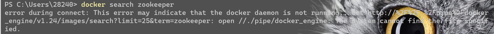
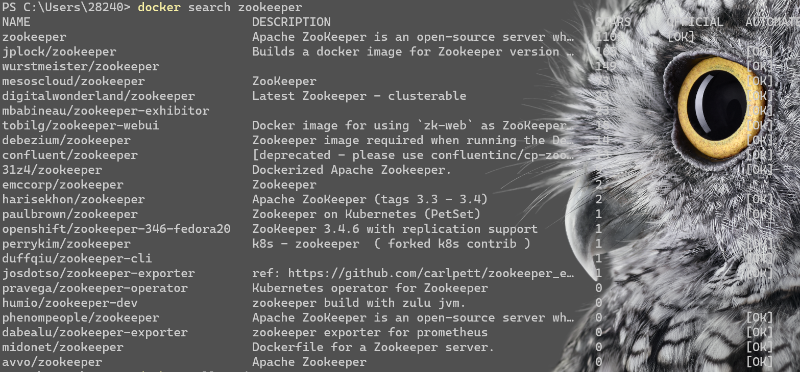
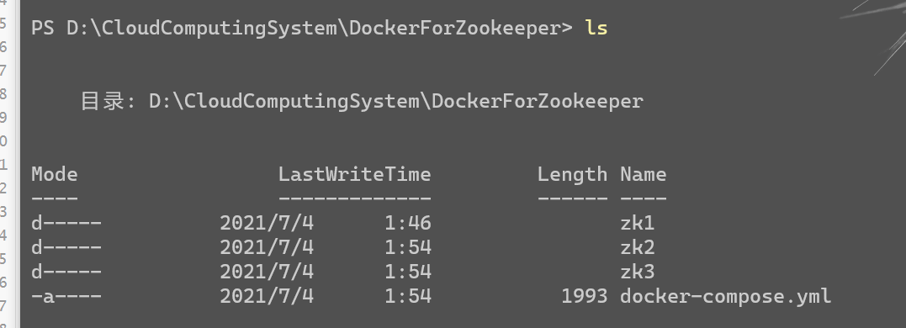
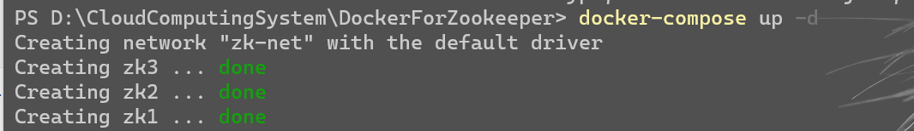
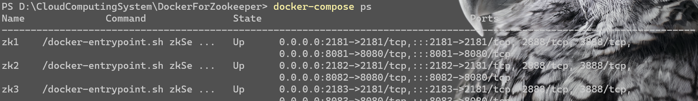
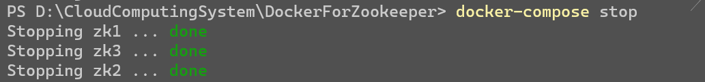
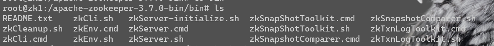

系统环境为 Windows

## Prerequisites

### 开启 Hyper-V

确保你开启了 Hyper-V,可以使用管理员身份运行 PowerShell 或者 Terminal，输入命令` bcdedit /set hypervisorlaunchtype auto`并进行重启，*注意虚拟机软件 VMWARE 以及 VirtualBox 一些版本与 Hyper-v 存在冲突，如果想要使用它们，需要关闭 Hyper-V,使用命令`bcdedit /set hypervisorlaunchtype off`*

### 搜索 zookeeper 镜像

打开 PowerShell 输入`docker search zookeeper`，如果提示 docker 命令无法识别，请下载 docker 并将其加入电脑的环境变量 Path 中，路径名一般为`#安装路径\Docker\Docker\resources\bin`.

如果出现以下场景



以管理员身份运行 cmd，在`#安装路径\Docker\Docker`路径下运行`DockerCli.exe -SwitchDaemon`，再次尝试使用`docker search`，如果仍然不行，请重新安装 Docker

搜索后会出现



使用 apache 的官方镜像即可，使用`docker pull zookeeper`进行下载

## docker-compose 启动集群

`docker-compose.yml`文件内容如下

```yaml
# 给zk集群配置一个网络，网络名为zk-net
networks:
    zk-net:
      name: zk-net
  
# 配置zk集群的
# container services下的每一个子配置都对应一个zk节点的docker container
services:
    zk1:
        # docker container所使用的docker image
        image: zookeeper
        hostname: zk1
        container_name: zk1
        # 配置docker container和宿主机的端口映射
        ports:
            - 2181:2181
            - 8081:8080
        # 配置docker container的环境变量
        environment:
            # 当前zk实例的id
            ZOO_MY_ID: 1
            # 整个zk集群的机器、端口列表
            ZOO_SERVERS: server.1=0.0.0.0:2888:3888;2181 server.2=zk2:2888:3888;2181 server.3=zk3:2888:3888;2181
        # 将docker container上的路径挂载到宿主机上 实现宿主机和docker container的数据共享
        volumes:
            - ./zk1/data:/data
            - ./zk1/datalog:/datalog
        # 当前docker container加入名为zk-net的隔离网络
        networks:
            - zk-net

    zk2:
        image: zookeeper
        hostname: zk2
        container_name: zk2
        ports:
            - 2182:2181
            - 8082:8080
        environment:
            ZOO_MY_ID: 2
            ZOO_SERVERS: server.1=zk1:2888:3888;2181 server.2=0.0.0.0:2888:3888;2181 server.3=zk3:2888:3888;2181
        volumes:
            - ./zk2/data:/data
            - ./zk2/datalog:/datalog
        networks:
            - zk-net

    zk3:
        image: zookeeper
        hostname: zk3
        container_name: zk3
        ports:
            - 2183:2181
            - 8083:8080
        environment:
            ZOO_MY_ID: 3
            ZOO_SERVERS: server.1=zk1:2888:3888;2181 server.2=zk2:2888:3888;2181 server.3=0.0.0.0:2888:3888;2181
        volumes:
            - ./zk3/data:/data
            - ./zk3/datalog:/datalog
        networks:
            - zk-net
```

*注意：如果你的 docker-compose 版本小于 1.27.0，请在文件开头指定 version*

这边除了`docker-compose.yml`，我还创建了zk1、zk2、zk3 三个文件夹供容器挂载使用



使用`docker-compose up -d`启动集群



使用`docker-compose ps`进行 查看



使用`docker-compose stop` 停止



使用`docker exec -it zk1 /bin/bash`进入 zk1 容器内部（进入其他容器同理）

`cd bin`->`ls`进行查看



使用`./zkCli.sh`进行客户端连接，你可以使用输入一些 zookeeper 命令进行验证

## Reference

> [Hyper-V 与虚拟机冲突解决](https://blog.csdn.net/weixin_40943540/article/details/103027246 )
>
> [docker daemon is not running 解决](https://stackoverflow.com/questions/67788960/error-during-connect-this-error-may-indicate-that-the-docker-daemon-is-not-runn?r=SearchResults )
>
> [docker 搭建 zookeeper 集群](https://zhuanlan.zhihu.com/p/72467871)
