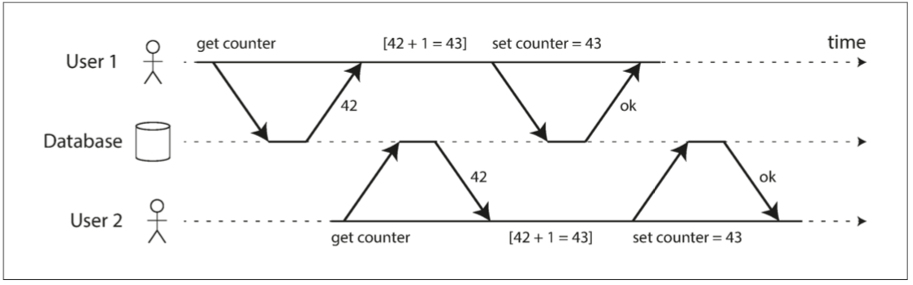

## ACID

- Atomicity: All-Or-Nothing. Transaction 涉及到的多个操作要么一同完成，要么什么都没有做，不能处于 half-finished 的状态。因为各种各样的 fault （比如crash、network connection interruption 以及 disk fail 等问题）可能会导致事务中的操作并没有全部完成，atomicity 为数据库的状态提供了一种确定性的保证。

- Isolation：涉及到 Concurrency，也是探讨的重点。

- Consistency: DDIA 中提到 Consistency 其实应该和数据库没有什么关系, .应用应该依赖数据库的 Atomicity 和 Isolation 去达成 Consistency，但是数据库无法直接提供这样的一种保障。

  

  *invariants* 是一个经常提到的概念，比如在一个只涉及到转账的财务系统中，所有账户上的金额加起来的总和应该是一个不变的定值。数据库只是存储数据，所以它不能防止应用自己往里面写入错误的数据从而破坏 Consistency

  

- Durability: 指事务提交后，无论发生了什么 fault，其状态应该持久化地保存下来。在单机系统上常常指数据被持久化到磁盘上，或者说在 WAL 上记录成功。而在分布式系统中由于涉及到副本同步的问题，所以定义起来复杂一点。

## Isolation level

这其实在面试中也会经常遇到，DDIA 书中要讲得细致不少

### Read Uncommitted

这一隔离级别下会遇到脏读问题。



*Dirty reads: One Client reads another client’s write before they have committed*



脏读可能带来的影响：

- 一个事务可能会看到另一个事务的部分更新，这有可能使得当前事务做出错误的决策
- 因为一个事务并不一定会成功，脏读使得一个事务可能看到稍后会回滚的数据

很多数据库的文档都没有特别提到脏写这个问题，这边略微提一下




*Dirty writes: One client overwrites data that another client has written, but not yet committed* 



脏写的问题可以用行锁解决（*Row-level Lock*）

### Read Committed

解决脏读可以使用和解决脏写类似的方式：加锁，但是这样可能会使得许多 read-only transactions 不得不等待一个 long-running write transaction 执行完毕，这严重影响了只读事务的响应时间。

所以实际工程中，一般采取以下的方法：对于每一个写的对象，记录下旧的提交值以及当前持有写锁的事务设置的新值，事务尚未提交时，其他事务获得的是旧的提交值，一旦事务提交成功，那么立马切换到新值进行读取。

不过 Read Committed 仍然存在不可重复读的问题。



*Read skew(nonrepeatable reads): A client sees different parts of the database at different points in time.*




### Repeatable Read

解决不可重复读常用的方法是 *Snapshot Isolation*. 



*A key principle of Snapshot Isolation:*

***Readers never block writers,and writers never block readers.***

读不需要获取任何锁



***MVCC(Multi-version concurrency control)：*** 数据库会保存对象的不同提交版本，在一个事务的执行过程中，它看到的是冻结在某个时间点的数据库的快照。



实际上 MVCC 也可以用来实现 Read Committed 的隔离级别。典型的方法是*read committed uses a separate snapshot for each query, while snapshot isolation uses the same snapshot for an entire transaction.*



#### 更多问题......

Read Committed 以及 Repeatable Read 中，探讨更多的是 Concurrency Read.而并行的两个写事务中经常会遇到 *lost updates* 这个问题



*Lost updates: Two clients concurrently perform a read-modify-write cycle. One overwrites the other’s write without incorporating its changes, so data is lost.*





问题的核心在于 *a read-modify-write cycle*: 读取当前值，依据当前值计算新值，再将更新后的值写回。MVCC 对这种情况无能为力。

##### 解决方式

- **Atomic write operations**: 许多数据库提供了原子更新操作，所以就不再需要通过事务实现 read-modify-write cycle. 实现原子更新的一种方式是使用互斥锁（比较普遍），另一种方式是强制要求所有的原子操作在一个单线程上执行。

  ```mysql
  UPDATE counters SET value = value + 1 WHERE key = 'foo'
  ```

- **Explicit locking**:  读取时声明读取的结果将用于更新，显式地加锁，从而强制使一个事务对一个对象的读操作延迟到另一个事务的 read-modify-write cycle 结束以后。

  ```mysql
  SELECT * FROM child WHERE id > 100 FOR UPDATE;
  # FOR UPDATE指示数据库应该对查询结果涉及的所有行加锁
  # mysql中一般select读取的是快照值，而FOR UPDATE会使得select读取当前值
  ```

在一些不提供事务支持的数据库中，它们提供了类似 compare-and-set 这样的操作。但是要注意的是，如果数据库允许其从一个旧的快照中读值的话，lost updates 仍会发生.

#### 还不够......

在 lost updates 中两个写事务更新的是同一个对象，而在 Write skew 中两个事务可能会各自更新不同的对象。

我们可以认为 *Write skew is a generalization of the lost update problems*: 如果两个事务读相同的对象，然后更新一些对象。在特例中，不同的事务更新的是同一个对象，我们可能会遇到 dirty write 或者 lost updates(取决于时间)



*Write skew: A transaction reads something,make a decision based on the value it saw, and writes the decision to the database. However, by the time the write is made, the premise of the decision is no longer true.*



一些例子：

- 会议室预订：检查某一个时间段是否有人预约，没有则插入一条预约记录。如果有两人同时在预约，可能会出现问题
- Unique name: 如果名字要求唯一，那么新用户注册时需要查询名字是否已经被注册，如果没有则插入。如果两人同时注册相同的名字，可能会出现问题

*Phantom causes write skew!*

`SELECT FOR UPDATE`并不能完全避免 Phantom 的问题[^1]



*Phantom reads: A transaction reads objects that match some search condition. Another Client makes a write that affects the results of that search.*



stackoverflow[^2]上有一篇问答区分了 Non-Repeatable Read 以及 Phantom Read 的差异：

> A non-repeatable read occurs, when during the course of a transaction, a row is retrieved twice and the values within the row differ between reads.

> A phantom read occurs when, in the course of a transaction, two identical queries are executed, and the collection of rows returned by the second query is different from the first.

*while the **Non-Repeatable Read** applies to a single row, the **Phantom Read** is about a range of records which satisfy a given query filtering criteria.*

##### 解决方式

###### Materializing conflicts

我觉得这个方式还挺有意思的，因为`SELECT FOR UPDATE`不能给不存在的 row 加锁，所以它就类似于创建了一个 lock table.以会议室预订为例，我们可以提前创建出会议室与时间段的所有组合构成的 row（时间粒度可以选择接下来的六个月）。如果要预订某个时间段的会议室，我们就可以使用`SELECT FOR UPDATE`对这样实际存在的 row 加锁。

DDIA 中将 Materializing conflicts  解释为 *it takes a phantom and turns it into a lock conflict on **a concrete set  of rows that exist in the database***

不过这样的方法并不优雅，不仅 materializing conflicts 本身具体如何操作很困难，而且把并发控制机制泄露给应用数据模型这件事就很 weird. 所以不到万不得已并不应该考虑它

###### 2PL

S/X Lock 实现，不做赘述

性能很糟糕，MySQL 的 InnoDB 在实现 serializable isolation level 时使用的就是 2PL

###### Predicate locks

前面提到问题的关键是 *can’t lock that doesn’t exist yet*，所以这里转换思路 ***lock predicates instead of locking records***[^3]




Pdf[^3]给出的 solution 2: Precision Lock 其实就是 DDIA 中提到的 Predicate Lock，只不过加入了 S/X 的区分，实现起来仍然代价高昂



###### Index-range locks	

*Index-range locking* 或者称为 *next-key locking*，是 *predicate lock* 的一种近似模拟。相比于 *predicate lock*,其粒度粗了一点点，比如说预订正午12点到下午一点的 NO.123 会议室，我们可以锁住 No.123 会议室的全时间段或者正午12点到下午一点的所有会议室房间，这些都包含了被 predicate 匹配的对象，所以是安全的。

这里可以参考一下 MySQL 中的 *Next-Key Locks*[^4]



InnoDB 经常提到的三种锁：

- Record Lock: 单个行记录上的锁。
- Gap Lock: 间隙锁，锁定一个范围，但不包括记录本身。
- Next-Key Lock: Record Lock + Gap Lock,锁定一个范围且包括记录本身 *(To be precise,  it’s a combination of  a record lock on the index record and a gap lock on the gap **before** the index)*



举一些例子[^5]，假设表拥有`id`值为[5, 10, 11, 13, 20]的行，以下语句

```sql
SELECT * FROM child WHERE id = 13 FOR UPDATE;
```

search 使事务会持有 (11, 13] 的 Next-Key lock 以及 gap lock (13,  20)

而以下语句

```sql
SELECT * FROM child WHERE id > 15 FOR UPDATE;
```

scan 会使得事务持有 gap lock(20, +∞) 以及 Next-Key lock (13, 20];在引入 Next-Key lock 前，上面提到`SELECT FOR UPDATE`不能完全解决幻读问题在于事务只会持有 gap lock(20, +∞) ，它不能阻止另一个事务插入 `id` 值为 16, 17, 18, 19 的行。


## 参考

[^1]:[Phantom  Rows](https://dev.mysql.com/doc/refman/8.0/en/innodb-next-key-locking.html)
[^2]: [difference between Non-Repeatable  Read and Phantom Read](https://stackoverflow.com/questions/11043712/what-is-the-difference-between-non-repeatable-read-and-phantom-read)
[^3]:[lock-pdf](http://www.scs.stanford.edu/nyu/02fa/notes/l8.pdf)
[^4]:[Next-Key Locks](https://dev.mysql.com/doc/refman/8.0/en/innodb-locking.html)
[^5]:[Rules of MySQL Gap-lock/Next-key Locks](https://stackoverflow.com/questions/52399319/rules-of-mysql-gap-lock-next-key-locks)

