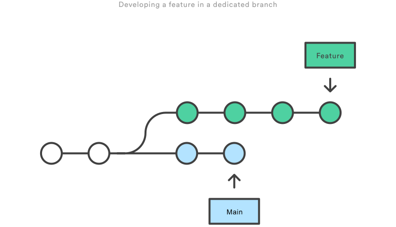

昨天师兄让我基于他的例子用技术栈重写监控脚本时，需要从 master 获取最新的提交。之前在学校也有过一些使用 git 进行团队协作的经历，所以出于习惯使用了`(MyBranch)$ git merge master` 。使用 git log 检查提交记录时发现 log 非常混乱，师兄提醒我说从 master 获取时最好使用`git rebase`,因为这个大库有很多人在开发，master 分支异常活跃，与学校小组作业 3-4人的开发完全不同。在这里系统地学习一些 `git base`以及 `git merge`在使用上的区别

merge 和 commit 都是将一个分支的变化合并进另一个分支，但是它们工作方式上有一些区别,以下是示意图


merge 会保留一个有用的，语义化的

rebase 会移除整个 feature 分支，并在 main 分支的基础上重写原先 feature 分支的提交记录，这样 project history 会更加清晰、简练并且是 linear 的。

## 应用场景

### 合并提交记录

加入`-i`选项执行`git rebase -i main`，会出现vi编辑器并显示即将被移除重新叠加的提交

```tex
pick b3676f70e feat: message1
pick 10ed50e1f fix: message2
pick a99d36b1d fix: message3

# Rebase 26c3db1..26c3db1 onto 26c3db1 (3 commands)
#
# Commands:
# p, pick <commit> = use commit
# r, reword <commit> = use commit, but edit the commit message
# e, edit <commit> = use commit, but stop for amending
# s, squash <commit> = use commit, but meld into previous commit
# f, fixup <commit> = like "squash", but discard this commit's log message
# x, exec <command> = run command (the rest of the line) using shell
# b, break = stop here (continue rebase later with 'git rebase --continue')
# d, drop <commit> = remove commit
# l, label <label> = label current HEAD with a name
# t, reset <label> = reset HEAD to a label
# m, merge [-C <commit> | -c <commit>] <label> [# <oneline>]
# .       create a merge commit using the original merge commit's
# .       message (or the oneline, if no original merge commit was
# .       specified). Use -c <commit> to reword the commit message.
#
# These lines can be re-ordered; they are executed from top to bottom.
#
# If you remove a line here THAT COMMIT WILL BE LOST.
#
# However, if you remove everything, the rebase will be aborted.
#

```

可以使用其中提示到的一些指令来变更提交说明或者压缩提交记录，这样会使得你分支的 history 更为清晰

如果保存时遇到这个错误：

```
error: cannot 'squash' without a previous commit
```



**WARNING:** 注意不要合并先前已经提交的内容！



如果异常退出 vi 编辑窗口

使用`git rebase --edit-todo`继续编辑，修改后使用`git rebase --continue`保存

### Workflow 

在工作中我们经常会需要开发新 feature，我们一般不会直接在 master 做更新，一般会创建一个专有分支来进行开发，如图所示



当开发新 feature 周期比较长时，main 分支时可能有大量的更新，我们可以定时进行 rebase，确保我们的 feature 时有意义的（可以及时发现可能存在的冲突），我们有两个选择：

1. 基于 feature 的父分支（比如 main），这种情况在前面讲 merge 和 rebase 区别时已经提到了
2. 基于 feature 分支的之前的提交版本，执行`git rebase -i HEAD~3`可以用来合并最近的 3 次提交记录（base 正是 `HEAD～3`），这种情况其实主要是为了合并提交日志，它不会囊括上游的变化


## 一些注意点

### *Note1*

**Never use rebase on** ***public*** **branch!**

如果 rebase main onto feature, git 会人会你的 main 分支已经与其他人的 main 分支偏离了


同步两个 main 分支的部分就是 merge，但是这会带来一次额外的 merge commit以及两组包含着相同变更的 commits

### *Note2*

当你发起 pull request 请求后最好不要使用`git rebase`，因为其他的开发者会看到你的提交，这是它就是*public* branch.

### *Note3*

main 上合并 feature 时通常使用 merge 而不是 rebase，不过如果 feature 分支合并前事先执行过 rebase再合并会得到一个很好的 linear history

### *Note4*

rebase 时可能会出现 conflict，需要我们去 resolve，解决后使用`git add`去更新，但是无需执行`git commit`，只需要执行`git rebase --continue`

在任何时候可以使用`git rebase --abort`来终止rebase，这样分支会回到 rebase 开始前的状态

### *Note5*

`git rebase`是危险操作，因为它会改变历史，使用它应该谨慎

只要分支上需要 rebase 的所有 commits 历史还没有被 push 过，就可以安全使用 

今天我 rebase 的部分commits 已经被我提交了，所以与remote repository产生了一些冲突，但是如果能够确认这是私有分支，可以使用 `git push -f`进行覆盖

## Reference

> https://www.atlassian.com/git/tutorials/merging-vs-rebasing
>
> http://jartto.wang/2018/12/11/git-rebase/
