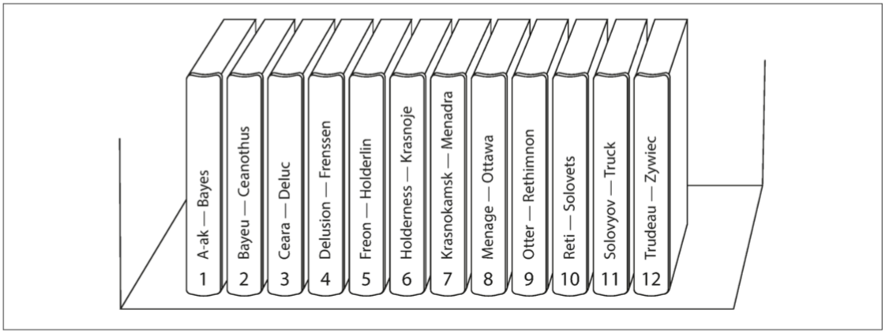

# 前言

分布式系统概念繁多，如果对其没有体系化的认知，学到的知识很容易成为孤岛，一头埋进实现的琐碎细节里，缺乏整体的把握，这样的学习过程会非常痛苦。

所以本文是我对自己所学的一个整理，从 3W 原则出发来看分布式系统。

# WHY——为什么需要分布式系统？

回答 what 之前，我觉得很有必要探讨下 why :分布式系统是在什么背景下提出来的以及它所解决的问题。

**计算机有两个重要的概念：数据和计算，数据是计算的对象，而计算是数据得到利用创造价值的过程。**

- 计算上的需求：在单台服务器上，运算量太大以及太慢，我们可以选择多线程编程，利用多核和并行尽可能榨取 CPU 的带宽和性能。但还是太慢了，如果选择 SCALE UP  (纵向拓展)，就是提升单个节点的能力 ，使用更快和更多的 CPU，然而成本增长的速度往往快于线性增长，同时由于散热以及访存的原因往往容易存在瓶颈而不足以处理相应的载荷
- 存储上的需求：数据量的飞速增长，对于存储提出了越来越高的要求。如果数据规模远远超过 SCALE UP 的上限，我们只能选择通过 SCALE OUT (横向拓展),以增加节点的方式来分担存储的压力。同时在多个节点上各自处理相应数据的计算任务，利用  data locality 也可以更好地节省带宽
- 容错性：单台服务器出现故障就无法对外提供服务，使用多台机器提供冗余可以提升服务的质量
- 延迟：如果大洋东岸的用户想要获取大洋西岸的服务器上的数据，网络包不得不穿越半个世界，如果在世界各地部署多个服务器，可以提供延迟更低、用户体验更好的服务
- 拓展性：如果只使用单台服务器，当现有服务器无法应对日益增长的用户规模和业务需求时，更换服务器重新部署不仅麻烦，而且还未必能很好地解决问题，使用分布式系统拓展性更好

# WHAT——什么是分布式系统？

>A distributed system consists of multiple autonomous computers that communicate through a computer network. The computers interact with each other in order to achieve a common goal.
>
>• There are several autonomous computational entities, each of which has its own local memory
>
>• The entities communicate with each other by information  passing

**简而言之，分布式系统就是由多台计算机通过一个计算机网络交流并协作，来完成一个共同目标或解决一个共同问题**

# HOW——如何去设计分布式系统以及设计面对的挑战？

## 数据划分（分区）

Partition 或者也可以称作 shard 问题

既然谈到协作解决一个共同问题，那么分治的一个核心就是如何去分解问题，那么我们不得不思考以下一些问题

1. 是否能保证数据的分布均匀？
2. 新增或者删除节点时，数据如何在各节点间迁移？迁移的数据规模有多大？
3. 元数据如何管理？（元数据：当数据分布在各个节点时，我们需要记录各自数据所在的节点位置以及状态等信息，它是 **data about  data**  即关于数据的数据  ）
4. 如何抽取数据的特征？

### 哈希方式

最常见的数据分布方式 ，其按照数据的某一特征值计算哈希值，并建立与机器的映射关系。数据特征值可以是key-value 系统中的key,也可以是与业务逻辑相关的值（比如数据属于的用户ID).考虑一个最简单的散列函数 mod N. N 可以是服务器的数量，**但在工程上需要考虑服务器的副本冗余，将数台服务器编程一组，N为组的总数量**

理论上，只要哈希函数的散列特性较好，它可以较为均匀地将数据分布到集群中。其记录的元信息也比较简单：hash函数以及取模的 N.

然而其缺点很明显：加入或者删除节点时，会有大量的数据需要移动，有时这种大规模的数据迁移会影响到系统对外的正常服务。为了减少迁移的数据量，节点的数目往往成倍增长，这样概率上讲至多有50%的数据需要迁移。

还有一种改善拓展性的思路是将对应关系的元数据由专门的服务器进行管理，此时取模的 Partitions 数量往往大于机器个数（组数）.每一台（组）机器负责多个取模的余数。在扩容时，将部分余数迁移到新机器上。不过在访问数据时，需要查询元数据服务器找到负责该数据的机器，这对元数据服务器提出了比较高的要求。

它的另一个缺点是很容易因为选择的特征值而出现**偏斜（data skew）**问题。如当以用户ID来哈希划分时，某个用户的数据量特别庞大，导致大量的负载压在一个分区上，使其成为**热点（hot spot)**.更糟糕的是，在这种情况下，通过扩展集群规模，并不能将热点的负载分散到其他节点。

当然，我们可以选择新的数据特征值来重新计算哈希，比如像数据库的联合主键那样，将ID与另一个维度的数据属性组合甚至全部数据计算哈希，但如果这样做，虽然数据会完全打散在集群中，但是数据之间的关联性会消失，当试图读取一个特定的值（比如与某个用户有关的所有数据）时，你不得不并行地查询所有的节点。



hash 对范围查询并不友好，尤其是范围涉及到的键恰好是用于计算 hash 的主键。不过在范围查询不涉及主键的情况下会有一些特殊的做法，比如查询一个用户在一段时间内的所有记录，可以使用 *compound primary key*，它是由几列的数值拼接而成的。前面的部分（如user_id）可以决定所在的 partition，而关于这个用户的数据在这个分区像 SST 那样有序排列（字符串排序中，在前半部分相同的情况下，由后半部分的值呈现出一种有序性），这样比单纯地遍历分区中的所有数据并筛选要高效得多。





不同于单纯的 key-value,在很多关系型数据库中还有 secondary index,有时一些请求会直接针对 secondary index 做请求，比如 *Table Car(ID,  color, make)*，ID是分区的主键，去查询颜色为银色的所有车，如果没有一些针对的处理措施，就必须去访问所有分区的数据。一般有两种方法，*document-based partitioning*以及*term-based partitioning* 



### 根据数据范围

为每个分区（每组机器）指定连续的键范围。

键的范围不一定均匀分布，以 DDIA 书中的图来举例，第一卷包含以A和B开头的单词，而第十二卷则包含了从T-Z的单词。这是因为数据量在键范围上的分布并不均匀，某个区间的数据可能要比其它要多得多。

边界可以手动选择，也可以根据数据量来自动选择，进行动态调整。比如当某个区间的数据量达到阈值时，就自动分裂成两个区间，当有新的节点加入时，就可以分配给它们达到均衡的目的

但是这种划分方式要求系统维护的元数据（数据分布信息）规模比较庞大，且随着集群规模的增长，元数据服务很容易成为瓶颈。

在DDIA中也提到，Key Range同样可能会因为特定的访问模式和键的选取而导致热点。在键是时间戳的情况下，分区对应时间范围，在一些业务中，一天访问的数据很可能大部分都属于今天（比如新闻网站），那么今天对应的分区就会成为热点。在这种情况下，可以考虑重新选取适当的key进行区域划分。

### 一致性哈希

一致性哈希可谓大名鼎鼎，很多面试相关的书都会提到它。其将数据按照特征值映射到一个首尾相接的 hash 环上，同时也将节点映射到这个环上。数据从环上的位置 开始顺时针遇到的第一个节点就是其负责节点。一致性哈希需要将节点在环上的位置作为元数据进行管理，但总体来说这个数据规模要比 Key Range 要小得多

一致性哈希与哈希方式相比，其拓展性要好不少，每次添加或删除节点仅影响其相邻节点 ，**然而仅影响相邻节点也成为它的缺陷**，当节点异常从环上删除时，其负责的数据全部由下一个节点承担，导致其压力突增。

因此，一般会引入**虚拟节点 （virtual node）**来改善这个问题。在初始创建比较多的虚拟节点分布在环上，并由一个物理节点映射多个虚拟节点。在访问数据时，通过哈希值先找到虚拟节点，然后访问元数据服务器根据映射关系找到实际负责的物理节点。当一个物理节点失效时，环上的多个虚拟节点同时失效，其负载会均摊给多个节点；增加节点时同理。

但是，**There is no free lunch**.引入虚拟节点后其需要维护的元数据也会增加，一部分来自于虚拟节点在环上的位置，一部分则是映射关系。

#### 一些补充

使用 hash 相比于Range Based 能更好地解决热点问题，因为可以把某种访问数据上的局部性（频繁访问某个范围上的数据）进行均摊。但是它并不能完全避免它，前面也提到了很可能有大量的访问针对同一个键。

hash 的优点也使得它失去了高效执行范围查询的能力，相邻的键分散在所有分区中，它们的顺序丢失了。此时查询不得不从多组机器上读取数据并进行合并。再一次，**There is no free lunch**.

所以设计时可以根据业务模型灵活选择，或者采取 hybrid 的策略，只对少量火爆的主键进行 hash 处理

